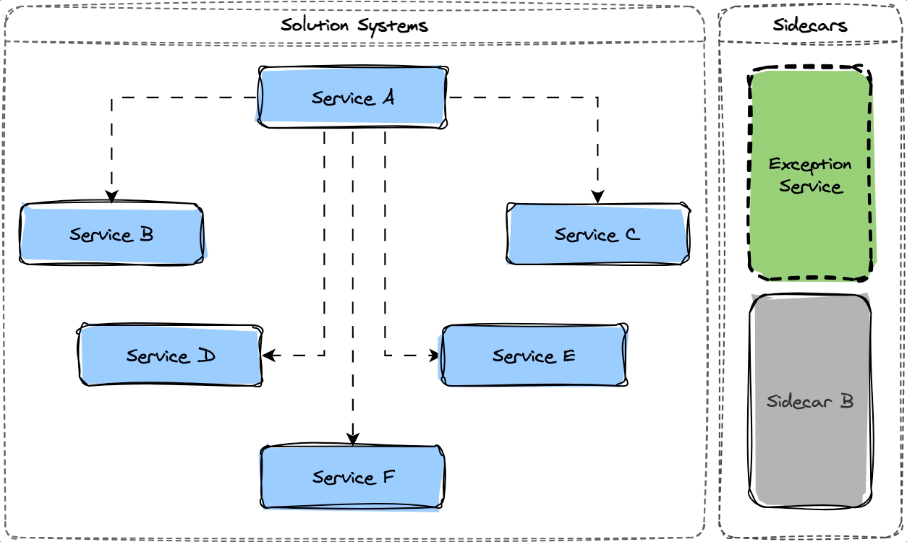

<h1 style="text-align: center;">Fault Shield Core</h1>

<p style="text-align: center;">
  <a href="https://www.apache.org/licenses/LICENSE-2.0"></a>
  <a href="https://openjdk.org/projects/jdk/17/"></a>
  <a href="https://github.com/spring-projects/spring-boot/releases/tag/v3.1.5"></a>
<a href="https://spring.io/blog/2023/05/25/spring-cloud-2022-0-3-aka-kilburn-is-available"></a>
</p>

## Table of Contents

- [Purpose](#purpose)
- [Features](#features)
- [Requirements](#requirements)
- [Dependencies](#dependencies)
- [Building](#building)
- [Configuration](#configuration)
- [Supported Exception Types](#supported-exception-types)
    - [HTTP Responses](#http-responses)
    - [Checked Exceptions](#checked-exceptions)
    - [Unchecked Exceptions](#unchecked-exceptions)
    - [Errors](#errors)
- [Custom Exception Code Convention](#custom-exception-code-convention)
    - [Code Format](#code-format)
    - [Example](#example)
- [Getting Started](#getting-started)
- [Usage Guide](#usage-guide)
- [Diagram](#diagram)

## Purpose
<a name="purpose"></a>

This is a powerful Java library designed to simplify exception handling and provide consistent, detailed error responses across different layers of your application. It supports various types of exceptions and errors, and provides customizable error codes based on a defined convention.

## Features
<a name="features"></a>

- Standardized error responses for common HTTP status codes.
- Exception handling for checked and unchecked exceptions.
- Support for custom exception codes based on a naming convention.
- Easy integration with existing and new applications.
- Detailed documentation and usage guide.

## Requirements
<a name="requirements"></a>

The list of tools required to build and run the project:

* Open JDK 17
* SpringBoot 3.1.5
* Spring Cloud 2022.0.3

## Dependencies
<a name="Dependencies"></a>

| Group Id                  | Artifact Id                    | Versión     |
| ------------------------- | -----------------------        | ----------- |
| org.springframework.boot  | spring-boot-starter-web        | 3.1.5       |
| org.springframework.boot  | spring-boot-starter-validation | 3.1.5       |
| org.springframework.cloud | spring-cloud-starter-openfeign | 4.0.3       |
| io.github.openfeign       | feign-core                     | 4.0.3       | 
| org.projectlombok         | lombok                         | 1.18.30     |
| org.springframework.data  | spring-data-rest-webmvc        | 4.1.5       |

## Building
<a name="building"></a>

In order to build project use:

```bash
mvn clean install
```

If your maven repository is local, u can see artifact in:

```bash
Windows: C:\Users\<User_Name>\.m2\repository
```
```bash
Linux: /home/<User_Name>/.m2/repository
```
```bash
Mac: /Users/<user_name>/.m2/repository
```

## Configuration
<a name="configuration"></a>

Configuration can be updated in `application.properties`

## Supported Exception Types
<a name="supported-exception-types"></a>

### HTTP Responses
<a name="http-responses"></a>

| HTTP Status Code  | Message           | Description                                              |
| ----------------- | ----------------- | ----------------------------------------------------     |
| 400               | Bad Request       | Invalid request or missing parameters.                   |
| 401               | Unauthorized      | Authentication failure.                                  |
| 403               | Forbidden         | Insufficient permissions to access a resource.           |
| 404               | Not Found         | Requested resource not found.                            |
| 412               | Precondition Failed | Precondition in the request header evaluated to false. |
| 500               | Internal Server Error | Generic server error.                                |
| 503               | Service Unavailable | Requested service is temporarily unavailable.          |

### Checked Exceptions
<a name="checked-exceptions"></a>

| Exception Class    | Description                                          |
| ------------------ | ---------------------------------------------------- |
| IOException        | Input/output operation failure.                     |
| SQLException       | Database operation failure.                         |
| ClassNotFoundException | Class not found.                                  |
| InstantiationException | Object instantiation failure.                      |
| NoSuchMethodException | Method not found.                                |
| MethodArgumentNotValidException | Invalid method argument.                        |
| UndeclaredThrowableException | Unhandled runtime exception.                   |

### Unchecked Exceptions
<a name="unchecked-exceptions"></a>

| Exception Class    | Description                                          |
| ------------------ | ---------------------------------------------------- |
| NullPointerException | Null value used in a context that requires an object. |
| ArithmeticException | Arithmetic operation failure.                       |
| ArrayIndexOutOfBoundsException | Array index out of bounds.                     |
| IllegalArgumentException | Illegal argument used.                             |
| IllegalStateException | Illegal state detected.                           |
| ConcurrentModificationException | Concurrent collection modification.         |

### Errors
<a name="errors"></a>

| Error Class        | Description                                          |
| ------------------ | ---------------------------------------------------- |
| NoSuchMethodException | Method not found.                                |
| OutOfMemoryError   | JVM runs out of memory.                            |
| StackOverflowError  | Stack overflow occurs.                             |
| VirtualMachineError | General JVM error.                                |
| AssertionError     | Assertion failure.                                 |
| NoClassDefFoundError | Class not found.                                  |
| LinkageError       | Linkage problem.                                   |
| ExceptionInInitializerError | Static initializer exception.                  |

## Custom Exception Code Convention
<a name="custom-exception-code-convention"></a>

Fault Shield Core supports a custom exception code naming convention to generate unique error codes based on application, error classification, and application layer.

### Code Format
<a name="code-format"></a>

```bash
<application-prefix>_<error-classification>_<application-layer>_<error-number>
```

### Example
<a name="example"></a>

- Application Prefix: **`APP-01`** (First application)
- Error Classification: **`E`** (Error)
- Application Layer: **`C`** (Controllers)
- Error Sequence: **`0001`** (Error sequence identifier)

Resulting Error Code: **`APP-01_E_C_0001`**

## Getting Started
<a name="getting-started"></a>

To use Fault Shield Core in your application, you can simply import it as a Maven dependency and extend one of the provided classes. For more details, check the

## Usage Guide
<a name="usage-guide"></a>

1. Import Maven dependency
    ```xml
       <dependency>
            <groupId>io.github.codexjp</groupId>
            <artifactId>fault-shield-core</artifactId>
            <version>0.0.2</version>
        </dependency>
    ```
2. Identify the layer or component from which we want to throw our custom exception: Controller, Service, Repository, etc...
---
3. Modify the properties file to add the property: `spring.application.package` with the name of the main package of your application. Example:
    ```properties
       spring.application.package=com.example.<myapp>
    ```
---
4. Configure the main application class to scan both the library packages (`fault-shield-core`) and your application's packages. Example:
    ```java
       @SpringBootApplication
       @ComponentScan(basePackages = {
         "com.example.springbootmyapp",
         "com.codexjptech.faultshieldcore"
       })
       public class SpringBootMyAppApplication {
           public static void main(String[] args) {
               SpringApplication.run(SpringBootServicioPracticaApplication.class, args);
         }
       }
     }
    ```
---
5. Create an `Enum` class to list error codes specific to the layer or component being configured
    * Consider the layer or component of the application being configured: Controller, Service, Repository, etc.
    * Implement the [IGlobalErrorCodeBuilder](./src/main/java/com/codexjptech/faultshieldcore/util/IGlobalErrorCodeBuilder.java) interface.
   ```java
        public enum AppControllerErrorCodeEnum implements IGlobalErrorCodeBuilder {
            ERROR_EXAMPLE;

            private final String code;

            AppControllerErrorCodeEnum(){
                code = ERROR_CODE_MANAGER.generateControllerErrorCode();
            }

            @Override
            public String getCode() {
                return code;
            }

            @Override
            public String getEnumName() {
                return name();
            }        
        }
   ```    

6. Modify the `logback-spring.xml` file to link trace-level logs to the main package of the library (`fault-shield-core`) for accurate log printing of the application's errors.
    ```xml
       <configuration>
          <logger name="com.codexjptech.faultshieldcore" 
                  level="trace" 
                  additivity="false">
             <appender-ref ref="Console"/>
          </logger>
       </configuration>
   ```
---
7. Finally, create a custom exception for the type of component you wish to handle. To make it work, extend the [GlobalApplicationException](./src/main/java/com/codexjptech/faultshieldcore/exception/GlobalApplicationException.java) class.
    ```java
      public class AppControllerException extends GlobalApplicationException {
          public AppControllerException(String message, IGlobalErrorCodeBuilder errorCodeBuilder) {
              super(message, errorCodeBuilder);
          }
      }
    ```
8. Test

## Diagram
<a name="diagram"></a>

Here's a <b>context view</b> illustrating the use Exception Handler as a sidecar component:



## License

Project is licensed under the [Apache](LICENSE) license.

## Author

Copyright &copy; 2023, Jairo Polo

From [CodexJp](https://github.com/CodexJp)

[![][gravatar-psysiu]]()

[gravatar-psysiu]: https://gravatar.com/avatar/7410b502a65a7ffcac6a67c07d5fb521dcefc4b7edc8ca1d84ce66a090c87294