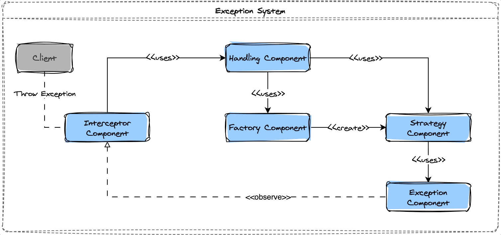

# Exception

How application manage exceptions

## Table of Contents
- [Supported Exception Types](#supported-exception-types)
    - [HTTP Responses](#http-responses)
    - [Checked Exceptions](#checked-exceptions)
    - [Unchecked Exceptions](#unchecked-exceptions)
    - [Errors](#errors)

## Supported Exception Types

### HTTP Responses

| HTTP Status Code  | Message           | Description                                              |
| ----------------- | ----------------- | ----------------------------------------------------     |
| 400               | Bad Request       | Invalid request or missing parameters.                   |
| 401               | Unauthorized      | Authentication failure.                                  |
| 403               | Forbidden         | Insufficient permissions to access a resource.           |
| 404               | Not Found         | Requested resource not found.                            |
| 412               | Precondition Failed | Precondition in the request header evaluated to false. |
| 500               | Internal Server Error | Generic server error.                                |
| 503               | Service Unavailable | Requested service is temporarily unavailable.          |

### Checked Exceptions

| Exception Class    | Description                                          |
| ------------------ | ---------------------------------------------------- |
| IOException        | Input/output operation failure.                     |
| SQLException       | Database operation failure.                         |
| ClassNotFoundException | Class not found.                                  |
| InstantiationException | Object instantiation failure.                      |
| NoSuchMethodException | Method not found.                                |
| MethodArgumentNotValidException | Invalid method argument.                        |
| UndeclaredThrowableException | Unhandled runtime exception.                   |

### Unchecked Exceptions

| Exception Class    | Description                                          |
| ------------------ | ---------------------------------------------------- |
| NullPointerException | Null value used in a context that requires an object. |
| ArithmeticException | Arithmetic operation failure.                       |
| ArrayIndexOutOfBoundsException | Array index out of bounds.                     |
| IllegalArgumentException | Illegal argument used.                             |
| IllegalStateException | Illegal state detected.                           |
| ConcurrentModificationException | Concurrent collection modification.         |

### Errors

| Error Class        | Description                                          |
| ------------------ | ---------------------------------------------------- |
| NoSuchMethodException | Method not found.                                |
| OutOfMemoryError   | JVM runs out of memory.                            |
| StackOverflowError  | Stack overflow occurs.                             |
| VirtualMachineError | General JVM error.                                |
| AssertionError     | Assertion failure.                                 |
| NoClassDefFoundError | Class not found.                                  |
| LinkageError       | Linkage problem.                                   |
| ExceptionInInitializerError | Static initializer exception.                  |

## Diagram

Here's a component view illustrating the logical communication between the internal components of the library:

## License

Project is licensed under the [Apache](LICENSE) license.

## Author

Copyright &copy; 2023, Jairo Polo

From [CodexJp](https://github.com/CodexJp)

[![][gravatar-psysiu]]()

[gravatar-psysiu]: https://gravatar.com/avatar/7410b502a65a7ffcac6a67c07d5fb521dcefc4b7edc8ca1d84ce66a090c87294