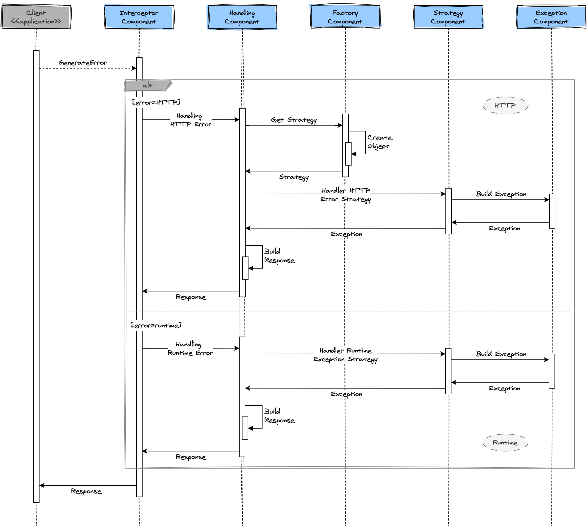

# Handling Strategies

How application use specific strategies in order to manage HTTP and Runtime exceptions  

## Diagram

Here's a sequence diagram illustrating how application decides which strategy to implement

## License

Project is licensed under the [Apache](LICENSE) license.

## Author

Copyright &copy; 2023, Jairo Polo

From [CodexJp](https://github.com/CodexJp)

[![][gravatar-psysiu]]()

[gravatar-psysiu]: https://gravatar.com/avatar/7410b502a65a7ffcac6a67c07d5fb521dcefc4b7edc8ca1d84ce66a090c87294